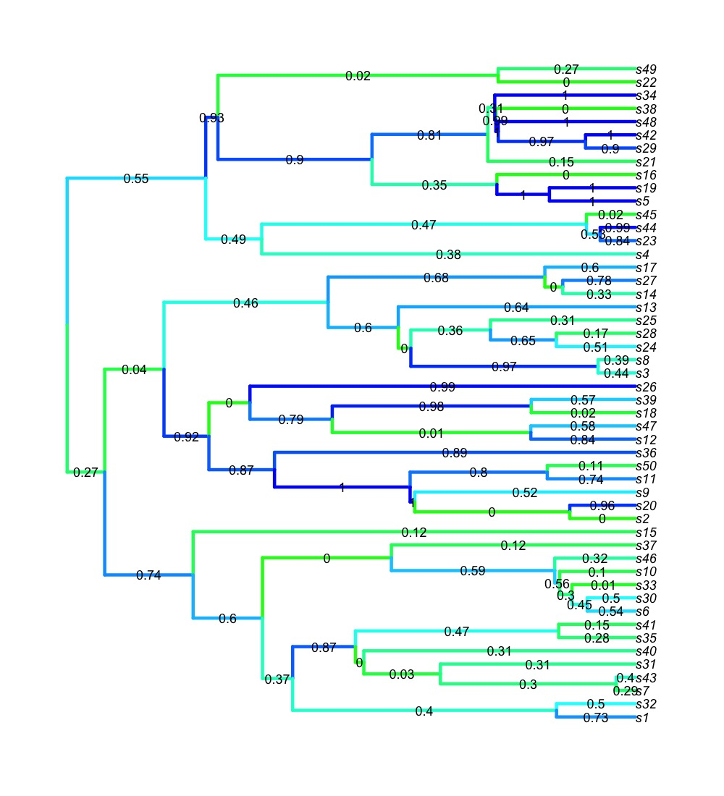
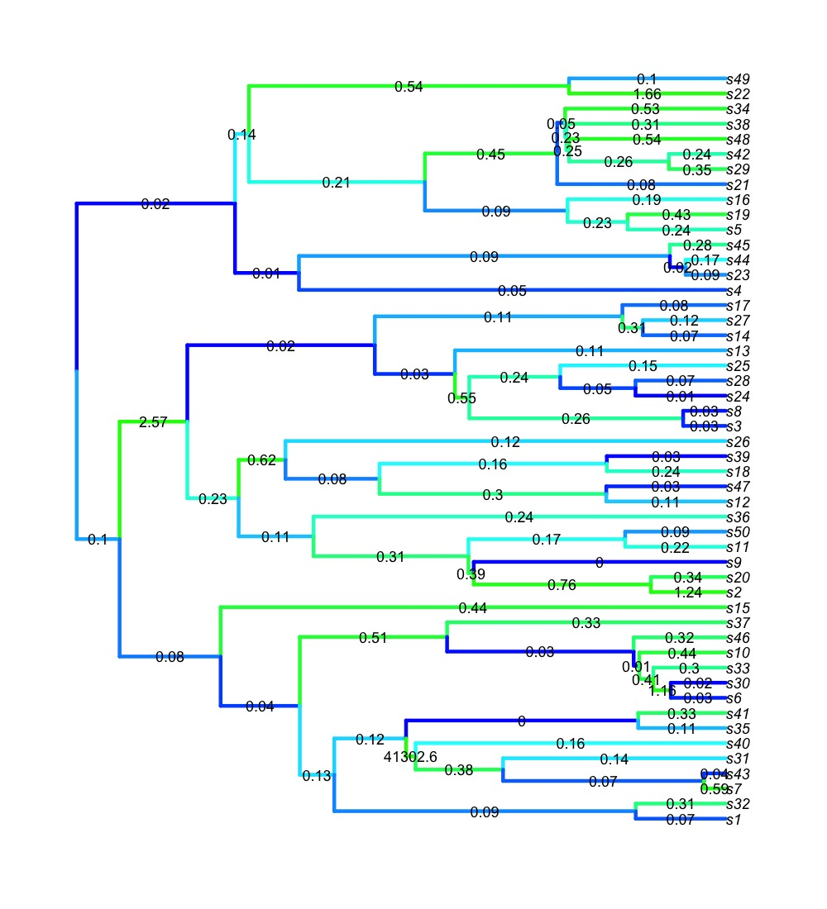

This repository was made to accompany the article 'Evaluating the adequacy of molecular-clock models using posterior predictive simulations'
--------------------------------------------------------------------------------------------------------------------------------------------

This repository was contributed by David Duchene and Sebastian Duchene

david.duchene[at]anu.edu.au

sebastian.ducnene[at]sydney.edu.au

21 May 2015

Summary
-------

This repository was designed to assess the adequacy of clock and substitution models used in phylogenetics. It requires the posterior of trees and parameter estimates, and provides the substitution model adequacy, the overall (*A* index) and branch-wise clock model adequacy, the effect size of the branch wise adequacy, and the uncertainty in posterior predictive simulations.

A flexible application for assessing clock model adequacy is being built. The present repository is specifically to accmpany the article; it is designed to test the clock model adequacy method on simulated data, so it is only suitable for the output of analyses from BEAST2 and a single gene partition. Clock models supported are the strict clock, the uncorrelated lognormal clock, and the random local clock. Substitution models supported inlcude the JC, HKY, and GTR models, including gamma-distributed rates with 4 discrete categories.

The following are a set of examples of how to use the functions and how to present the results.

All the code and examples are for R. The code requires the that the R packages ape, phangorn, and associated dependencies are installed.

Example of usage
----------------
In the folder example_run_and_results you will find a simulated sequence alignment with 2000 nucleotides in nexus format (al.nex) and chronogram in newick format (chrono.tre) with 50 taxa. The alignment was simulated along the chronogram under a Jukes-Cantor substitution model and with rate auto-correlation among lineages. You will also find an XML file to run BEAST 2 under a strict clock and a Jukes-Cantor model of substitution and a root calibration.

In this folder we also include the output log and tree files from BEAST 2, and the results from assessing clock and substitution model adquacy using the functions in the folder clock_modad.

The following is example code to run and save the results for clock model adequacy after the BEAST 2 run has completed.

Begin by opening R. The following will set the working directory to clock_modad in the cloned repository, and then source all the functions in the folder.

```coffee
setwd("[INSERT THE PATH TO clock_modad]")
for(i in dir()) source(i)
```

Next, we set the directory to example_run_and_results, and run the function adeq(). The arguments for this function are the posterior of trees in nexus format, the log file, the alignment in nexus format, and the number of posterior predictive simulations to be performed.

```coffee
setwd("../example_run_and_results")
clock_adequacy_example <- adeq(trees.file = "sim.trees", sim.log ="sim.log", empdat.file = "al.nex", Nsim = 100)
names(clock_adequacy_example)
```

The elements in clock_adequacy_example are each of the components that can be used to assess clock and substitution model adequacy (this assessment of substitution model adequacy is sensitive to rate variation among lineages, so the assessment from a clock free analysis, e.g. from MrBayes, is more appropriate). 

The clock_adequacy_example object should have the same contents as object "allres" in the file results.Rdata:

```coffee
load("results.Rdata")
names(allres)
```

The following section uses the results from results.Rdata to produce a variety of useful graphics.

Graphical examples of results
-----------------------------
It is strongly recommended to use qualitative checks of models using graphical analyses. This section uses the results in example_run_and_results/results.Rdata to graph different components for assessing clock model adequacy using posterior predictive simulations.

The following script shows a simple example to explore the branch wise posterior predictive p-values. It requires to have the tree loaded. In this case we will use the original simulated tree, but ususally the tree with the median posterior branching times would be appropriate. In blue we will colour the branches with good accuracy, and in green the branches that have poor accuracy.

```coffee
tr <- read.tree("chrono.tre")
plot(tr, edge.col = rainbow(length(allres$branch_wise_pppvalues), start = 2/6, end = 4/6)[rank(allres$branch_wise_pppvalues)], edge.width = 6, cex = 1.5)
edgelabels(allres$branch_wise_pppvalues, bg = "white", cex = 1.5, frame = "none")
```



The following script shows a simple example to explore the branch wise length deviation, which is another metric for accuracy. We apply the same colouring system as the plot above, but note that in the case of branch length deviation larger numbers indicate greater deviation from the empirical branch length, and therefore lower accuracy.

```coffee
plot(tr, edge.col = rainbow(length(allres$branch_length_deviation), start = 4/6, end = 2/6)[rank(allres$branch_length_deviation)], edge.width = 6, cex = 1.5)
edgelabels(round(allres$branch_length_deviation, 2), bg = "white", cex = 1.5, frame = "none")
```



Note that in this simple method to graph the results, the branches in the two plots above have been coloured by their rank, rather than their magnitude. 

